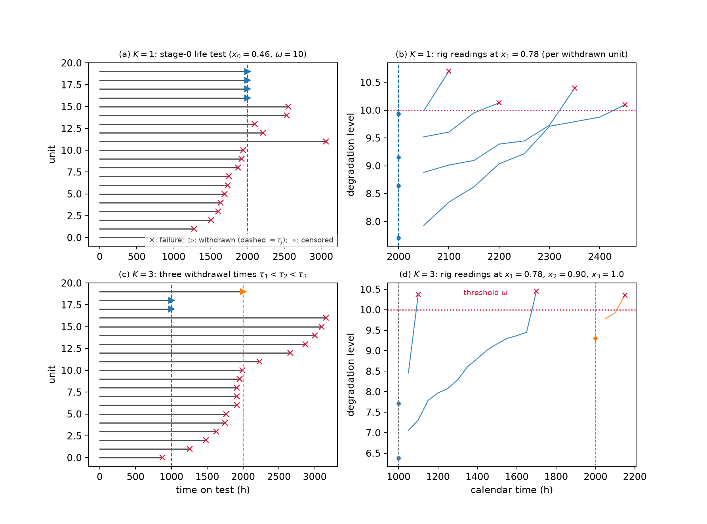
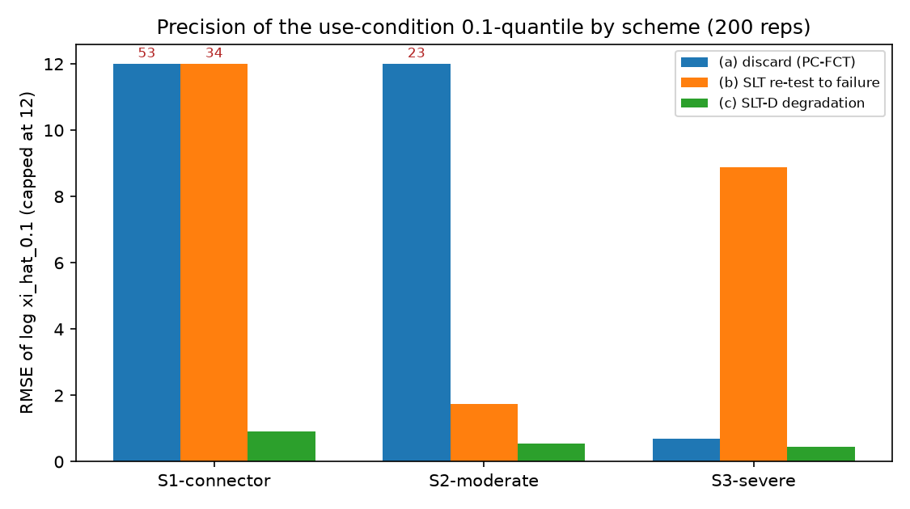
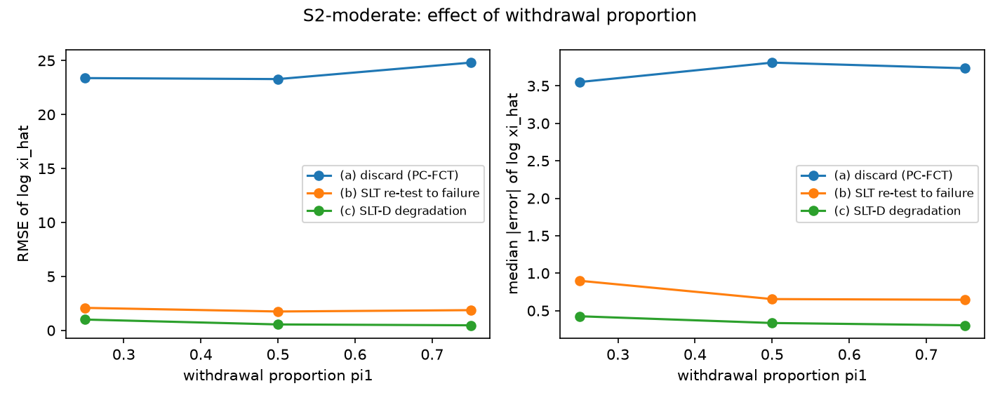
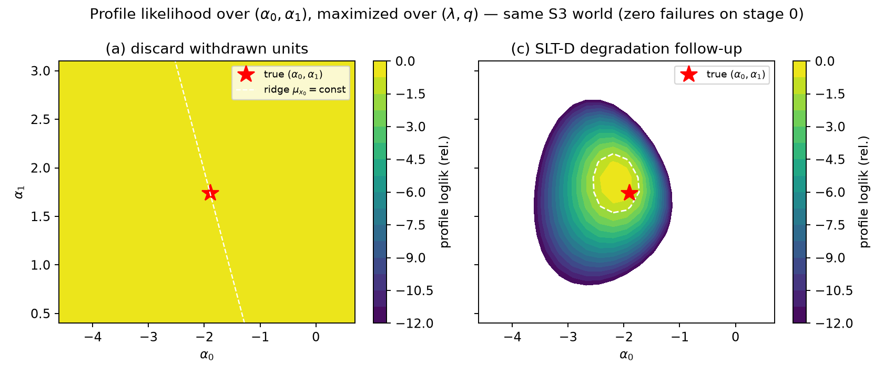
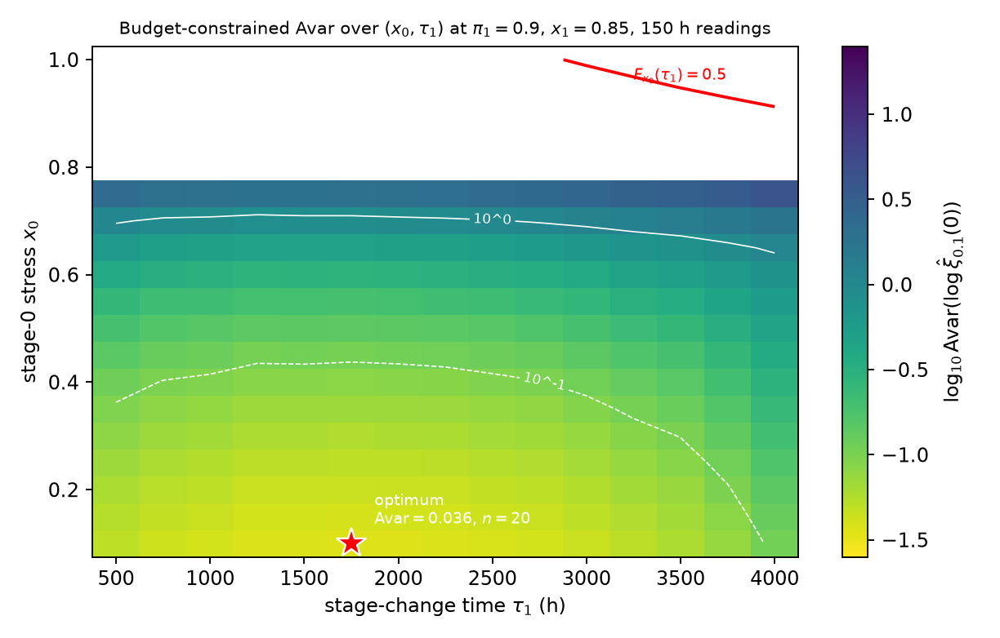
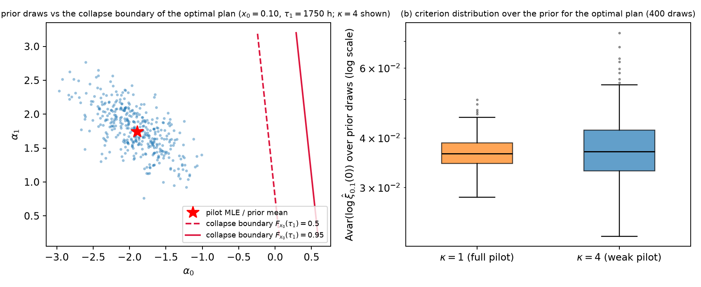
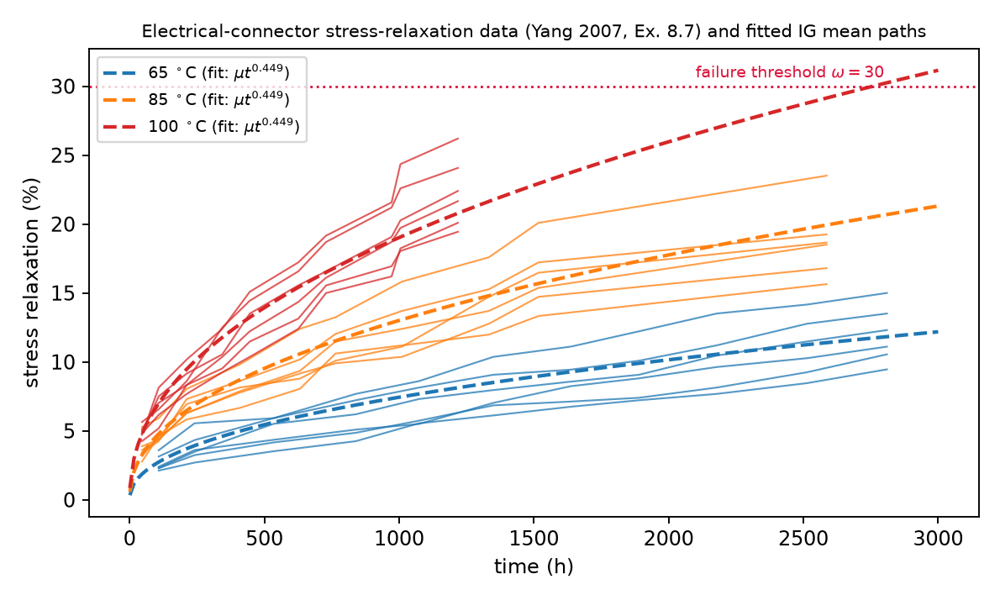
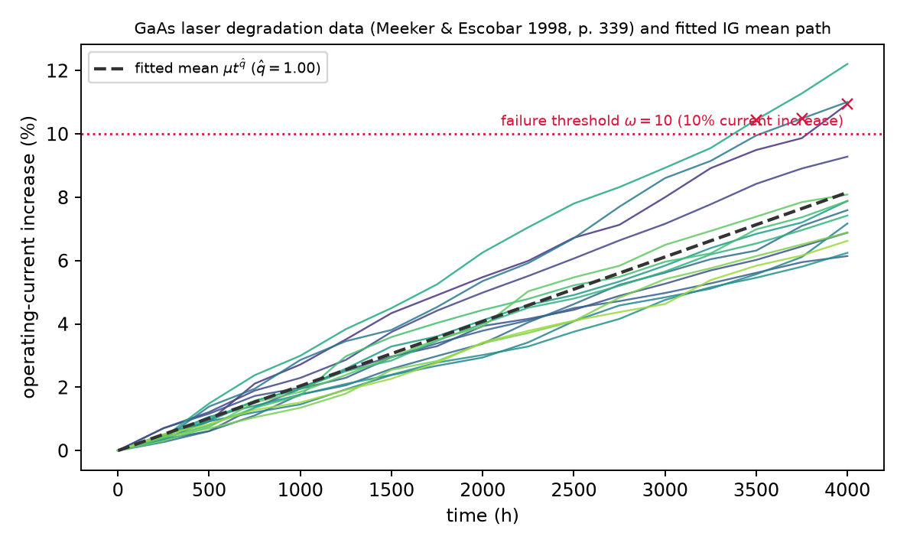

<div align="center">

# SLT-D — Stage Life Testing with Degradation Data

**A stage-wise hybrid life–degradation test for highly reliable products**

Code, simulation results, and manuscript for the paper by
**Ramakrushna Mishra**, Decision Sciences Area, IIM Lucknow

[](https://www.python.org/)
[](https://numpy.org/)
[](https://scipy.org/)
[](SLT-D_manuscript.pdf)

</div>

---

## Overview

In a progressively censored life test, the units withdrawn at the stage-change time are
usually discarded — or, in the **stage life testing (SLT)** of Laumen & Cramer (2019),
re-tested to failure at higher stress. **SLT-D** does neither.

Withdrawn units are moved to an instrumented rig at an elevated stress, where a baseline
reading and periodic **degradation measurements** are taken until the end of the test. The
same physical units contribute **failure-time information first and degradation information
afterwards** ("unit recycling") — which recovers usable inference even when the ordinary life
test produces few or zero failures.

| | discards withdrawn units | uses withdrawn units |
|---|---|---|
| **failure-time data only** | PC-FCT baseline *(scheme a)* | SLT — re-test to failure *(scheme b)* |
| **+ degradation data** | — | **SLT-D — degradation follow-up *(scheme c)*** |

---

## How the test works

<div align="center">

</div>

1. `n` units start a life test on stage 0 (stress $x_0$); failures before $\tau_1$ are recorded.
2. At the prefixed stage-change time $\tau_1$, a fraction $\pi_1$ of the survivors is randomly
   **withdrawn** and moved to a degradation rig at stress $x_1 > x_0$; a baseline reading and
   readings at $L$ prefixed epochs are taken until the horizon $T_{\max}$.
3. The units not withdrawn stay on stage 0 until failure or $T_{\max}$.
4. Withdrawal is by randomization among survivors, so the missingness is **ignorable** and the
   likelihood is a plain product of densities — no $\theta$-dependent censoring factors.

The right-hand panels show the rig readings; the multi-stage variant ($K = 3$ withdrawal times)
is a direct extension.

---

## Model & likelihood

An **inverse Gaussian (IG) degradation process** with a power-law time transform and an
Arrhenius-type stress link on the standardized scale $x \in [0, 1]$
($x = 0$ use condition, $x = 1$ highest stress). Parameter vector
$\theta = (\alpha_0, \alpha_1, \lambda, q)$.

$$Y_x(t) \sim \mathrm{IG}\!\big(\mu_x \Lambda(t),\ \lambda\,\Lambda(t)^2\big),
\qquad \mu_x = e^{\alpha_0 + \alpha_1 x}, \qquad \Lambda(t) = t^{q}.$$

Increments over disjoint intervals are independent, with $\delta = t_2^{q} - t_1^{q}$:

$$Y_x(t_2) - Y_x(t_1) \sim \mathrm{IG}\!\big(\mu_x\,\delta,\ \lambda\,\delta^2\big).$$

**First passage.** A unit fails when degradation crosses the threshold $\omega$. IG paths are
a.s. increasing, so with $a = \mu_x\Lambda(t)$, $b = \lambda\Lambda(t)^2$,
$u_1 = \sqrt{b/\omega}\,(1 - \omega/a)$, $u_2 = \sqrt{b/\omega}\,(1 + \omega/a)$:

$$F_x(t) = \Pr(T_x \le t) = \Pr\{Y_x(t) \ge \omega\}
= \Phi(u_1) - e^{2b/a}\,\Phi(-u_2).$$

**Use-condition quantile** (closed-form normal approximation, used for inference):

$$\xi_p(x) \approx
\left[\frac{\mu_x}{4\lambda}\left(z_p + \sqrt{z_p^{2} + 4\lambda\omega/\mu_x^{2}}\,\right)^{2}\right]^{1/q},
\qquad \xi_p \equiv \xi_p(0).$$

**Cumulative exposure across the stage change (path-level).** A unit at degradation level $b$
when the stress switches $x_0 \to x_1$ has **virtual age**

$$w(b) = \big(b / \mu_{x_1}\big)^{1/q},$$

and its continuation increment over $(u_{j-1}, u_j]$ is
$\mathrm{IG}\big(\mu_{x_1}\Delta\Lambda_{j},\ \lambda\Delta\Lambda_{j}^{2}\big)$ with
$\Delta\Lambda_{j} = (w + u_j)^{q} - (w + u_{j-1})^{q}$.

### The three schemes

All schemes share the stage-0 failure / censoring block (identical $n$, $\tau_1$, $T_{\max}$,
withdrawal rule):

$$\ell_0 = \sum_{\text{failures } i} \log f_{x_0}(t_i)
+ \sum_{\text{alive at } T_{\max}} \log\big(1 - F_{x_0}(T_{\max})\big) + r_1^{\ast}\log\big(1 - F_{x_0}(\tau_1)\big),$$

and differ only in the term for the $r_1^{\ast}$ withdrawn units:

| Scheme | Withdrawn-unit contribution |
|---|---|
| **(a)** discard | none — $\ell_a = \ell_0$ (single stress; $\xi_p$ at $x=0$ is **not identifiable**) |
| **(b)** SLT re-test | latent level $B \sim \mathrm{IG}$ truncated at $\omega$: $\ \log\int_0^{\omega} f_{\mathrm{IG}}(b)\,g(u \mid b)\,db\ $ (Gauss–Legendre quadrature) |
| **(c)** SLT-D | **closed form** (baseline $b_k$ + increments $\Delta_{kj}$): |

$$\ell_c = \ell_0
+ \sum_k \log f_{\mathrm{IG}}\big(b_k \mu_{x_0}\tau_1^{q},\ \lambda\tau_1^{2q}\big)
+ \sum_k \sum_j \log f_{\mathrm{IG}}\big(\Delta_{kj} \mu_{x_1}\Delta\Lambda_{kj} \lambda\Delta\Lambda_{kj}^{2}\big).$$

**Planning information** splits additively, and the design criterion follows by the delta method
on the closed-form quantile ($g = \log\xi_p$):

$$\mathcal{I}(\theta) = \underbrace{\mathcal{I}_{\text{fail}}}_{\text{stage-0 failures}}
+ \underbrace{\mathcal{I}_{\text{deg}}}_{\text{rig readings}},
\qquad
\mathrm{Avar}(\log\hat\xi_p) = \nabla g^{\top}\,\mathcal{I}(\theta)^{-1}\,\nabla g,$$

with an **alive-weighting** correction to $\mathcal{I}_{\text{deg}}$ for withdrawn units that fail
mid-rig. Full derivations: [MODEL.md](MODEL.md).

---

## Simulation study

Anchor parameters from the electrical-connector stress-relaxation data (Ma et al., 2021):
$\alpha_0 = -1.88$, $\alpha_1 = 1.73$, $\lambda = 0.653$, $q = 0.449$, $\omega = 30$.
200 replications with common random numbers across schemes; estimand $\log\xi_{0.1}$ at
$x = 0$.

| Scenario | $x_0$ | $x_1$ | $\omega$ | $n$ | $\tau_1$ | $T_{\max}$ | readings | regime |
|---|---:|---:|---:|---:|---:|---:|---|---|
| **S1** connector-like | 0.78 | 1.00 | 30 | 20 | 2000 | 5000 | every 150 h ($L=20$) | sparse failures |
| **S2** moderate | 0.46 | 0.78 | 10 | 20 | 2000 | 5000 | every 50 h ($L=60$) | rich failures |
| **S3** severe | 0.46 | 0.78 | 30 | 30 | 2000 | 5000 | every 150 h ($L=20$) | life test nearly blank |

### Estimator hierarchy (a) < (b) < (c)

RMSE / MdAE / p90 are on $\log\hat\xi_{0.1}$ (≈ relative error of the quantile).
$\bar d_1$ = mean stage-0 failures, $\bar r_1^{\ast}$ = mean withdrawn.

| Scenario | Scheme | $\bar d_1$ | $\bar r_1^{\ast}$ | Bias | RMSE | MdAE | p90 AE |
|---|---|---:|---:|---:|---:|---:|---:|
| S1 connector-like | (a) discard | 0.02 | 9.98 | 33.44 | 52.86 | 20.59 | 93.50 |
| S1 connector-like | (b) SLT re-test | 0.02 | 9.98 | 9.26 | 34.41 | 0.87 | 4.75 |
| S1 connector-like | **(c) SLT-D** | 0.02 | 9.98 | **0.09** | **0.92** | **0.61** | **1.48** |
| S2 moderate | (a) discard | 10.60 | 4.46 | 11.57 | 23.28 | 3.81 | 44.47 |
| S2 moderate | (b) SLT re-test | 10.60 | 4.46 | 0.44 | 1.75 | 0.65 | 2.86 |
| S2 moderate | **(c) SLT-D** | 10.60 | 4.46 | **0.03** | **0.55** | **0.34** | **0.88** |
| S3 severe | (a) discard | 0.00 | 15.00 | 0.59\* | 0.68\* | 0.56\* | 1.03\* |
| S3 severe | (b) SLT re-test | 0.00 | 15.00 | 2.73 | 8.88 | 0.24 | 10.43 |
| S3 severe | **(c) SLT-D** | 0.00 | 15.00 | **0.03** | **0.44** | **0.28** | **0.74** |

<sub>\* S3 has zero failures on stage 0, so scheme (a)'s likelihood is survival-only and
$\xi_p$ at $x = 0$ is unidentifiable; the tame numbers are an artifact of truth-anchored
optimizer starts (SE never finite). Report via a ridge plot, not RMSE.</sub>

<div align="center">

</div>

**Takeaways.** Degradation follow-up cuts RMSE of $\log\hat\xi_{0.1}$ by **3–37×** vs failure
re-testing at equal $(n, \tau_1, T_{\max})$, and never produces the catastrophic fits that
plague scheme (b) (S3 p90 absolute error 10.4 vs 0.74). The gain is largest exactly where
existing methods fail — highly reliable products with no early failures. In S3 the life test
yields **zero** failures, yet SLT-D still pins the use-condition quantile to ≈ ±44 % (log scale
0.44) with 30 units. Scheme (c) always yields finite observed information (100 %) with
conservative Wald coverage.

### Withdrawal fraction $\pi_1$ (S2)

More recycling into degradation measurement is better, provided stage 0 keeps enough units for
its censoring information.

| $\pi_1$ | Scheme | $\bar r_1^{\ast}$ | Bias | RMSE | MdAE | Cov. % |
|---:|---|---:|---:|---:|---:|---:|
| 0.25 | (b) / **(c)** | 2.03 | 0.72 / **0.28** | 2.09 / **1.00** | 0.90 / **0.43** | 94.2 / 87.8 |
| 0.50 | (b) / **(c)** | 4.46 | 0.44 / **0.03** | 1.75 / **0.55** | 0.65 / **0.34** | 92.0 / 92.6 |
| 0.75 | (b) / **(c)** | 6.83 | 0.52 / **−0.01** | 1.87 / **0.47** | 0.65 / **0.31** | 94.1 / 95.3 |

<div align="center">

</div>

### Why discarding withdrawn units fails

Profile likelihood over $(\alpha_0, \alpha_1)$ in the same zero-failure S3 world: scheme (a)
leaves a flat ridge along $\mu_{x_0} = \text{const}$ (use-condition extrapolation
unidentifiable); the degradation readings in scheme (c) close it.

<div align="center">

</div>

### Planning vs empirical variance

The additive Fisher-information formula tracks the simulated spread (upward bias expected at
$n = 20$–$30$).

| Design | $n$ | predicted $\mathrm{Avar}(\log\hat\xi_{0.1})$ | empirical var |
|---|---:|---:|---:|
| S1 | 20 | 0.658 | 0.839 |
| S2 | 20 | 0.192 | 0.303 |
| S3 | 30 | 0.175 | 0.194 |

---

## Optimal & Bayesian design

### Budget-constrained V-optimal plan (connector case, budget ≈ \$6,000)

| Design | $x_0$ | $\tau_1$ | $\pi_1$ | $x_1$ | step | $n$ | $\mathrm{Avar}(\log\hat\xi_{0.1})$ |
|---|---:|---:|---:|---:|---:|---:|---:|
| **constrained SLT-D** | 0.10 | 1750 | 0.90 | 0.85 | 150 | 20 | **0.0362** |
| unconstrained parallel two-level ADT | 0.00 | — | — | 0.20 | 150 | 16 | 0.0066 |

$\mathrm{Avar} = 0.036$ is ≈ ±21 % on the quantile (one SD, multiplicative). The price of the
**sequential** constraint relative to an unconstrained parallel ADT is a factor of ≈ 5.5 in
asymptotic variance.

<div align="center">

</div>

### Bayesian planning under a pilot-informed prior

Prior concentration $\kappa$ ($\kappa = 1$ full pilot, $\kappa = 4$ weak); $J$ = preposterior
criterion, $J_{90}$ its 90th percentile over the prior. The Bayes-optimal plan **coincides with
the plug-in plan**, and the criterion is stable even under a weak prior.

| Prior | Plan | $\tau_1$ | $\pi_1$ | $x_1$ | $n$ | $J$ | $J_{90}$ | Avar at mean |
|---|---|---:|---:|---:|---:|---:|---:|---:|
| $\kappa = 1$ | Bayesian ≡ plug-in | 1750 | 0.9 | 0.85 | 20 | 0.0368 | 0.0411 | 0.0362 |
| $\kappa = 4$ | Bayesian ≡ plug-in | 1750 | 0.9 | 0.85 | 20 | 0.0380 | 0.0472 | 0.0362 |

<div align="center">

</div>

<details>
<summary><b>Robustness — L9 orthogonal array over ±10 % planning-parameter errors</b></summary>

The re-optimized plan stays at $\pi_1 = 0.90$, 150 h readings throughout; $\tau_1$ moves within
1250–3250 h and $\mathrm{Avar}$ at truth stays in **0.036–0.052**.

| $\epsilon_{\alpha_0}$ | $\epsilon_{\alpha_1}$ | $\epsilon_{\lambda}$ | $\epsilon_{q}$ | $\tau_1$ | $\pi_1$ | step | Avar at truth |
|---:|---:|---:|---:|---:|---:|---:|---:|
| −10% | −10% | −10% | −10% | 2000 | 0.90 | 150 | 0.0391 |
| −10% | +0% | +0% | +0% | 2250 | 0.90 | 150 | 0.0370 |
| −10% | +10% | +10% | +10% | 3250 | 0.90 | 150 | 0.0518 |
| +0% | −10% | +0% | +10% | 2000 | 0.90 | 150 | 0.0364 |
| +0% | +0% | +10% | −10% | 1250 | 0.90 | 150 | 0.0369 |
| +0% | +10% | −10% | +0% | 2250 | 0.90 | 150 | 0.0370 |
| +10% | −10% | +10% | +0% | 1250 | 0.90 | 150 | 0.0369 |
| +10% | +0% | −10% | +10% | 2000 | 0.90 | 150 | 0.0364 |
| +10% | +10% | +0% | −10% | 1750 | 0.90 | 150 | 0.0362 |

</details>

---

## Case studies

### Electrical connectors — stress relaxation (Yang, 2007, Ex. 8.7; same data as Ma et al., 2021)

Our IG fit $(\hat\alpha_0, \hat\alpha_1, \hat\lambda, \hat q) = (-1.894,\ 1.738,\ 0.629,\ 0.449)$
reproduces the published $(-1.88,\ 1.73,\ 0.653,\ 0.449)$; $\xi_{0.1}(40^\circ\mathrm{C})$ is
119,743 h vs ≈ 116,278 h (3 % apart).

<div align="center">

</div>

### GaAs laser diodes (Meeker & Escobar, 1998, p. 339)

*What an SLT-D on this product would have delivered* — an SLT-D with only ≈ 7 units monitored
from $\tau_1$ nearly matches full monitoring of all 15 units from $t = 0$, and beats the
life-test-only design on the tail.

| Design | monitored units | degenerate fits | Bias | RMSE | MdAE | p90 AE |
|---|---|---:|---:|---:|---:|---:|
| full monitoring (historical) | 15 from $t = 0$ | 0/500 | +0.133 | 0.156 | 0.141 | 0.239 |
| **SLT-D** ($\tau_1 = 2000$, $\pi_1 = 0.5$) | ≈ 7 from $\tau_1$ | 0/500 | +0.139 | 0.230 | 0.099 | 0.358 |
| life test only | 0 | 1/500 | +0.042 | 0.193 | 0.068 | 0.216 |

<div align="center">

</div>

`data_GaAsLaser.csv` comes from Meeker's public repository of repeated-measured degradation
datasets (file `GaAsLaser.csv`).

<details>
<summary><b>Multi-stage extension (K withdrawal times)</b></summary>

Splitting the withdrawal across $K$ escalating stress levels lowers RMSE at fixed expected
readings; $\mathrm{RMSE}\cdot\sqrt{\bar r}$ (readings-adjusted) improves monotonically.

| $K$ | stages $(\tau, \pi, x)$ | $\mathbb{E}[R_1^{\ast}]$ | $\mathbb{E}[\#\text{readings}]$ | Bias | RMSE | MdAE | $\mathrm{RMSE}\cdot\sqrt{\bar r}$ |
|---:|---|---:|---:|---:|---:|---:|---:|
| 1 | (2000, 0.50, 0.78) | 4.49 | 14.7 | +0.045 | 0.540 | 0.337 | 2.07 |
| 2 | (1500, 0.30, 0.78); (3000, 0.30, 1) | 4.40 | 19.8 | +0.021 | 0.458 | 0.302 | 2.04 |
| 3 | (1000, 0.15, 0.78); (2000, 0.20, 0.90); (3500, 0.25, 1) | 3.87 | 20.6 | −0.001 | 0.421 | 0.308 | 1.91 |

</details>

---

## Repository layout

```
src/                  model, likelihoods, simulators, MLE, design theory, studies
tests/                correctness tests (score identities, quadrature vs MC, K=1 equivalence, ...)
scripts/              figure generation, design optimization, diagnostics
results/              generated tables (.tex), figures (.png), per-replication CSVs, JSONs

MODEL.md              formal model and likelihood derivation
RESULTS.md            study results and findings
SLT-D_manuscript.pdf  compiled manuscript
data_GaAsLaser.csv    GaAs laser degradation dataset
```

---

## Reproduction

Requires **Python 3** with `numpy`, `scipy`, `pandas`, `matplotlib`.

```bash
pip install -r requirements.txt
```

<details>
<summary><b>Full pipeline</b></summary>

```bash
# correctness tests (~5 min)
python3 -m unittest discover -s tests

# main simulation study (1000 reps x 5 design cells x 3 schemes; ~1 h, parallel)
PYTHONPATH=. python3 src/study.py 1000 results/per_rep_1000.csv

# figures and LaTeX tables from the study output
PYTHONPATH=. python3 src/make_tables.py
PYTHONPATH=. python3 scripts/make_figures_extra.py

# design optimization, Bayesian planning, laser case study
PYTHONPATH=. python3 scripts/design_optimize.py
PYTHONPATH=. python3 src/bayes_design.py
PYTHONPATH=. python3 src/study_laser.py 500
```

</details>

---

## Citation

> Mishra, R. *Stage life testing with degradation data: a stage-wise hybrid
> life–degradation test for highly reliable products.*

```bibtex
@unpublished{mishra-sltd,
  author = {Mishra, Ramakrushna},
  title  = {Stage life testing with degradation data: a stage-wise hybrid
            life--degradation test for highly reliable products},
  note   = {Decision Sciences Area, IIM Lucknow},
  url    = {https://github.com/rkmishra1/SLT-D}
}
```

---

## References

- Laumen, B., & Cramer, E. (2019). Stage life testing. *Naval Research Logistics*, 66(4), 355–374.
- Ma, Z., et al. (2021). A hybrid accelerated life/degradation testing plan. *Reliability Engineering & System Safety*.
- Meeker, W. Q., & Escobar, L. A. (1998). *Statistical Methods for Reliability Data*. Wiley.
- Wang, X., et al. (2016). Design of accelerated degradation tests with the inverse Gaussian process. *(cumulative-exposure model, Assumption A4)*.
- Yang, G. (2007). *Life Cycle Reliability Engineering*. Wiley. (Ex. 8.7)
- Ye, Z.-S., et al. (2014). The inverse Gaussian process as a degradation model. *Technometrics*.
